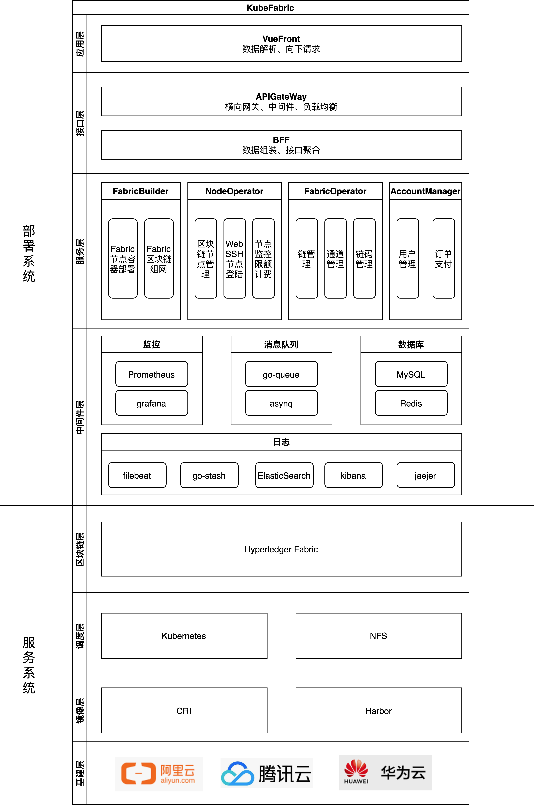

# KubeFabric：基于Kubernetes+Fabric的BaaS平台

## 一、概述
实现一个Kubernetes+Fabric的自动化部署BaaS平台用于:
* 快速、定制化部署多个Fabric集群构建联盟链，并提供监控、在线维护功能
* 实现多条Fabric链的管理，包括链管理、通道管理、链码管理，可在线在区块链上实现具体业务
* 资源按时按量计费以及用户管理

其特点在于：
* 可拔插：上层为下层提供统一接口，下层需满足上层接口即可适配
* 多样化：支持多种Fabric组网（solo、kfaka、raft）
* 微服务化、容器化：部署系统本身已经微服务、容器化，可以部署到一套Kubernetes平台
* 高可用、弹性伸缩：部署的Fabric集群节点冗余部署保证服务持续、可动态伸缩

## 二、系统架构与业务架构

### 2.1 系统架构
解耦为两套子系统，可独立部署：
1. 部署系统：依赖go-zero微服务框架，部署具体Fabric的服务系统
2. 服务系统：对外提供区块链服务

### 2.2 部署系统业务架构

## 三.功能描述

### 1.1 部署Fabric

- [ ] solo (FabricBuilder)
- [ ] kafka (FabricBuilder)
- [ ] etcraft (FabricBuilder)

### 1.2 环境调试

- [ ] 节点调试：webSSH (FabricBuilder)

### 1.3 监控

- [ ] 部署系统服务监控 (中间件层：Prometheus)
- [ ] 区块链监控
    - [ ] 区块链节点监控 (FabricBuilder)
    - [ ] 区块链浏览器 (FabricOperator)

### 1.4 资源伸缩

- [ ] 区块链资源：链、链码、通道 (FabricOperator)
- [ ] k8s集群：节点扩容、删除 (FabricBuilder)

### 1.5 上层业务

- [ ] 区块链：链码上传与访问 (FabricOperator)

### 1.6 资源计费

- [ ] 用户中心 (AccountManager)
- [ ] 支付、订单系统 (AccountManager)
- [ ] 按时计费

## 四、使用文档

1. [快速部署]()