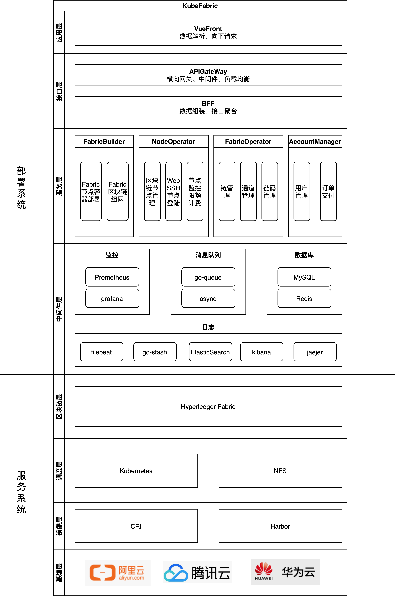

# 一、概述
实现一个Kubernetes+Fabric的自动化部署BaaS平台用于:
* 快速、定制化部署多个Fabric集群构建联盟链，并提供监控、在线维护功能
* 实现多条Fabric链的管理，包括链管理、通道管理、链码管理，可在线在区块链上实现具体业务
* 资源按时按量计费以及用户管理

其特点在于：
* 可拔插：上层为下层提供统一接口，下层需满足上层接口即可适配
* 多样化：支持多种Fabric组网（solo、kfaka、raft）
* 微服务化、容器化：部署系统本身已经微服务、容器化，可以部署到一套Kubernetes平台
* 高可用、弹性伸缩：部署的Fabric集群节点冗余部署保证服务持续、可动态伸缩

# 二、系统架构
解耦为两套子系统，可独立部署：
  1. 部署系统：依赖go-zero微服务框架，部署具体Fabric的服务系统
  2. 服务系统：对外提供区块链服务
  

# 三、部署系统业务架构

# 四、服务系统业务架构

# 五、技术栈

